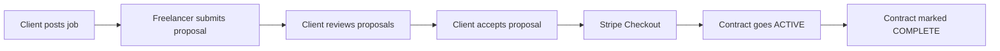
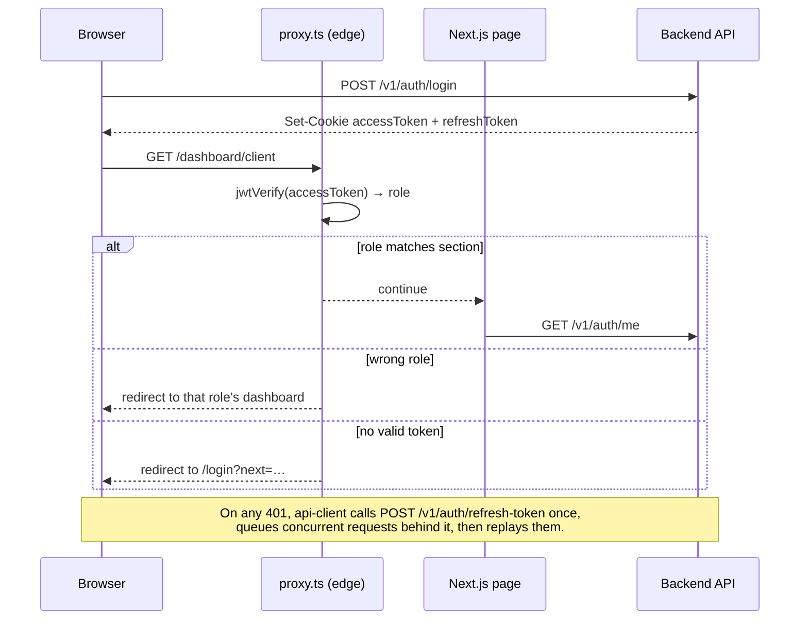
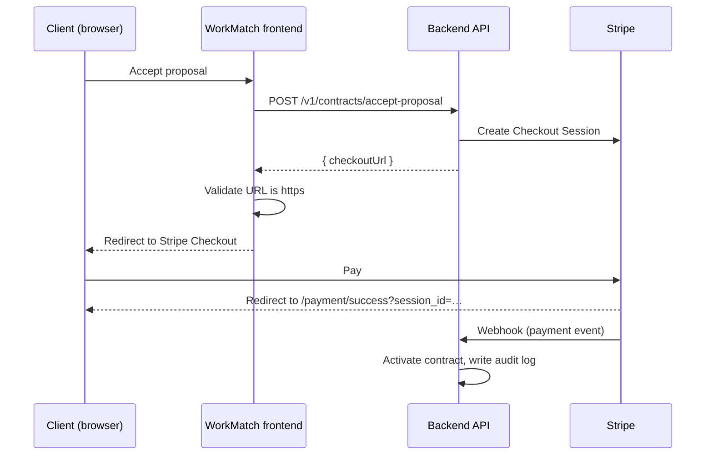

<div align="center">

# WorkMatch

**A role-based freelance and job listing marketplace.**
Clients post jobs, freelancers pitch with proposals, and payment runs through Stripe Checkout, all managed from one dashboard.

[](https://workmatch.dibbockb.com)
[](https://documenter.getpostman.com/view/54867039/2sBYHQ2NuZ)


[](#license)

[Live Demo](https://workmatch.dibbockb.com) · [Backend Repo](https://github.com/dibbockb/workmatch-backend) · [API Docs](https://documenter.getpostman.com/view/54867039/2sBYHQ2NuZ) · [Report a Bug](https://github.com/dibbockb/workmatch/issues)

</div>

---

## Table of Contents

- [WorkMatch](#workmatch)
  - [Table of Contents](#table-of-contents)
  - [Overview](#overview)
  - [Live Links](#live-links)
  - [Try It in 30 Seconds](#try-it-in-30-seconds)
  - [Features](#features)
    - [Client](#client)
    - [Freelancer](#freelancer)
    - [Admin](#admin)
    - [Platform](#platform)
  - [Tech Stack](#tech-stack)
  - [Architecture](#architecture)
    - [Project structure](#project-structure)
    - [Feature module pattern](#feature-module-pattern)
    - [Authentication flow](#authentication-flow)
    - [Payment flow](#payment-flow)
    - [Data validation](#data-validation)
  - [Route Map](#route-map)
  - [Getting Started](#getting-started)
    - [Prerequisites](#prerequisites)
    - [1. Clone and install](#1-clone-and-install)
    - [2. Configure environment](#2-configure-environment)
    - [3. Run](#3-run)
    - [Running the full stack locally](#running-the-full-stack-locally)
  - [Environment Variables](#environment-variables)
  - [Scripts](#scripts)
  - [Deployment](#deployment)
  - [Known Limitations](#known-limitations)
  - [Roadmap](#roadmap)
  - [Contributing](#contributing)
  - [License](#license)
  - [Author](#author)

---

## Overview

WorkMatch is the frontend of a full-stack freelance marketplace. It covers the complete hiring loop:

1. A **client** posts a job with a budget, deadline, required skills and experience level.
2. **Freelancers** browse open jobs and submit proposals with a price, timeline and approach.
3. The client reviews proposals and accepts one, which redirects them to **Stripe Checkout**.
4. Once payment clears, a **contract** goes live. When the work is delivered, the contract is marked complete.
5. An **admin** oversees the platform: user management, platform stats and a full audit trail.

The app talks to a separate REST API ([`workmatch-backend`](https://github.com/dibbockb/workmatch-backend)) built with TypeScript, Express, Prisma and PostgreSQL. Every workflow in the UI is backed by that API; there is no mock data.



---

## Live Links

| Resource | URL |
|---|---|
| Frontend (live) | https://workmatch.dibbockb.com |
| Frontend repository | https://github.com/dibbockb/workmatch |
| Backend API (live) | https://api.workmatch.dibbockb.com |
| Backend repository | https://github.com/dibbockb/workmatch-backend |
| API documentation | https://documenter.getpostman.com/view/54867039/2sBYHQ2NuZ |

---

## Try It in 30 Seconds

The login page has one-click **Demo Login** buttons for each role. No sign-up needed. If you prefer typing, the credentials are:

| Role | Email | Password |
|---|---|---|
| Admin | `admin@workmatch.com` | `!123QWEe` |
| Client | `client@workmatch.com` | `!123QWEe` |
| Freelancer | `freelancer@workmatch.com` | `!123QWEe` |

> These accounts exist for demonstration only and hold no real data.

**Suggested walkthrough**

1. Sign in as **Client**, open *Post a job*, and publish a job.
2. Sign out, sign in as **Freelancer**, open *Find work*, and submit a proposal on that job.
3. Back as **Client**, open the job, review proposals and accept one. You'll be sent to Stripe Checkout.
4. Pay with a Stripe test card (for example `4242 4242 4242 4242`, any future expiry, any CVC).
5. Sign in as **Admin** and check *Audit logs* to see the payment and contract events recorded.

---

## Features

### Client
- Dashboard overview with job and contract status breakdowns
- Post, edit, close and delete jobs, with validated forms (title, description, skills, budget range, deadline, duration, experience level)
- Review proposals per job, then accept or reject
- Stripe Checkout redirect on accept, with success and cancel return pages
- Contracts list with search and status filters, and a mark-complete action

### Freelancer
- Dashboard overview with proposal and contract statistics
- Browse and search open jobs with server-side pagination
- Job detail page with a proposal form (price, timeline, approach)
- Track proposals by status, withdraw pending ones, and see counter-offer history
- Contracts list showing counterpart, agreed price and payment breakdown

### Admin
- Platform overview: total users, jobs, contracts and platform commission revenue
- Role and job-status distribution charts
- User management with role and text filters, plus block and unblock (admins are protected from being blocked)
- Audit log viewer with category filters (contracts, payments, counter offers, users) and search

### Platform
- **Role-based access control** enforced at two layers: an edge proxy that verifies the JWT, and a client-side guard in each dashboard shell
- **Silent session refresh** with a single-flight refresh lock, so concurrent 401s trigger exactly one refresh request
- **Shareable URL state** for search and filters (for example `?category=payment&search=stripe`)
- **Runtime-validated API responses** with Zod schemas
- Light and dark themes, reduced-motion support, ARIA roles on interactive filters
- Toast notifications for mutations and API failures

---

## Tech Stack

| Layer | Technology |
|---|---|
| Framework | [Next.js 16](https://nextjs.org/) (App Router), [React 19](https://react.dev/) with React Compiler |
| Language | [TypeScript 5](https://www.typescriptlang.org/) |
| Styling | [Tailwind CSS 4](https://tailwindcss.com/), [shadcn/ui](https://ui.shadcn.com/) on [Base UI](https://base-ui.com/), `class-variance-authority`, `tailwind-merge` |
| Server state | [TanStack Query 5](https://tanstack.com/query) |
| Forms | [TanStack Form](https://tanstack.com/form) |
| Validation | [Zod 4](https://zod.dev/) |
| HTTP | [ofetch](https://github.com/unjs/ofetch) with cookie credentials |
| Auth | JWT in HTTP cookies, verified at the edge with [jose](https://github.com/panva/jose) |
| Payments | [Stripe Checkout](https://stripe.com/docs/payments/checkout) (session created by the backend) |
| Animation | [Motion](https://motion.dev/) |
| Icons | [Phosphor Icons](https://phosphoricons.com/), [Lucide](https://lucide.dev/) |
| Notifications | [Sonner](https://sonner.emilkowal.ski/) |
| Theming | [next-themes](https://github.com/pacocoursey/next-themes) |
| Tooling | [Bun](https://bun.sh/), [Biome](https://biomejs.dev/) |
| Hosting | [Vercel](https://vercel.com/) |

---

## Architecture

### Project structure

```text
src/
├── app/                      # Next.js App Router
│   ├── (auth)/               # login, signup
│   ├── (site)/               # landing, about, contact
│   ├── dashboard/
│   │   ├── admin/            # overview, users, audit-logs
│   │   ├── client/           # overview, jobs (list, detail, new), proposals, contracts
│   │   └── freelancer/       # overview, jobs (list, detail), proposals, contracts
│   ├── payment/              # success, cancel
│   ├── layout.tsx            # root layout, providers, toaster
│   ├── loading.tsx
│   └── not-found.tsx
├── features/                 # domain modules (one folder per resource)
│   ├── auth/                 # api.ts · queries.ts · schemas.ts
│   ├── jobs/                 # api, queries, schemas, list/detail/form components
│   ├── proposals/
│   ├── contracts/
│   └── admin/
├── components/
│   ├── ui/                   # shadcn/ui primitives
│   ├── dashboard/            # dashboard shell and per-role navigation config
│   ├── landing/              # navbar, user menu, site chrome
│   ├── motion/               # animated sidebar, loader, layout transitions
│   └── shared/               # page header, backdrop, not-found actions
├── lib/
│   ├── api-client.ts         # ofetch wrapper with single-flight token refresh
│   ├── env.ts                # Zod-validated public env
│   ├── roles.ts              # role → home route map
│   └── demo-accounts.ts      # one-click demo credentials
├── providers/                # React Query provider
└── proxy.ts                  # edge route protection (JWT verification)
```

### Feature module pattern

Each resource follows the same three-file split, so data access stays predictable and testable:

| File | Responsibility |
|---|---|
| `api.ts` | Plain async functions that call the backend and parse responses with Zod |
| `queries.ts` | TanStack Query hooks (`useQuery` / `useMutation`) and cache invalidation |
| `schemas.ts` | Zod schemas and inferred TypeScript types for requests and responses |

### Authentication flow



Two layers of protection:

1. **`src/proxy.ts`** verifies the access token (HS256) and redirects by role. Signed-in users are bounced away from `/login` and `/signup`, and a visitor to another role's section is sent to their own home.
2. **`DashboardShell`** re-checks the current user via `/v1/auth/me` and redirects on mismatch. The API remains the source of truth for authorization.

The `next` redirect parameter is sanitized against open-redirect tricks (`//`, `/\`).

### Payment flow



### Data validation

API responses are parsed with Zod before reaching components. A backend contract change fails loudly at the boundary instead of rendering `undefined` deep in the UI.

---

## Route Map

| Route | Access | Description |
|---|---|---|
| `/` | Public | Landing page |
| `/about` | Public | About WorkMatch |
| `/contact` | Public | Contact page |
| `/login` | Guests | Sign in, with one-click demo login |
| `/signup` | Guests | Register as Client or Freelancer |
| `/dashboard` | Authenticated | Redirects to the role's home |
| `/dashboard/client` | Client | Overview |
| `/dashboard/client/jobs` | Client | My jobs |
| `/dashboard/client/jobs/new` | Client | Post a job |
| `/dashboard/client/jobs/[jobId]` | Client | Job detail, edit, close, delete, review proposals |
| `/dashboard/client/proposals` | Client | All proposals received |
| `/dashboard/client/contracts` | Client | Contracts |
| `/dashboard/freelancer` | Freelancer | Overview |
| `/dashboard/freelancer/jobs` | Freelancer | Browse and search jobs |
| `/dashboard/freelancer/jobs/[jobId]` | Freelancer | Job detail and proposal form |
| `/dashboard/freelancer/proposals` | Freelancer | My proposals |
| `/dashboard/freelancer/contracts` | Freelancer | Contracts |
| `/dashboard/admin` | Admin | Platform overview and charts |
| `/dashboard/admin/users` | Admin | User management |
| `/dashboard/admin/audit-logs` | Admin | Audit trail |
| `/payment/success` | Authenticated | Stripe success return page |
| `/payment/cancel` | Authenticated | Stripe cancel return page |

---

## Getting Started

### Prerequisites

- [Bun](https://bun.sh/) 1.4+ (recommended, it is the project's package manager), or Node.js 20.9+ with npm/pnpm
- A running instance of the [WorkMatch backend](https://github.com/dibbockb/workmatch-backend), or use the hosted API at `https://api.workmatch.dibbockb.com`

### 1. Clone and install

```bash
git clone https://github.com/dibbockb/workmatch.git
cd workmatch
bun install
```

### 2. Configure environment

Create `.env.local` in the project root:

```bash
# Base URL of the backend API (no trailing slash)
NEXT_PUBLIC_SERVER_URL=https://api.workmatch.dibbockb.com

# Must be identical to the backend's JWT access-token secret.
# Used by src/proxy.ts to verify tokens at the edge.
JWT_ACCESS_SECRET=replace-with-the-backend-secret
```

> **Using the hosted API?** You won't know the production `JWT_ACCESS_SECRET`, and the edge proxy refuses to start without one. Run the backend locally instead (see its README) so both sides share a secret you control.

### 3. Run

```bash
bun dev
```

Open [http://localhost:3000](http://localhost:3000).

### Running the full stack locally

1. Clone and start [`workmatch-backend`](https://github.com/dibbockb/workmatch-backend) following its README, with a Stripe **test-mode** key and webhook secret.
2. Point `NEXT_PUBLIC_SERVER_URL` at it (for example `http://localhost:5000`) and set the same `JWT_ACCESS_SECRET` in both projects.
3. Seed or create the three demo accounts, or register new Client and Freelancer users from `/signup`.

---

## Environment Variables

| Variable | Required | Scope | Description |
|---|:---:|---|---|
| `NEXT_PUBLIC_SERVER_URL` | Yes | Browser + server | Backend base URL. Validated at startup by `src/lib/env.ts` (Zod). |
| `JWT_ACCESS_SECRET` | Yes | Server (edge proxy) | HS256 secret used to verify the `accessToken` cookie. The app throws on boot if missing. |
| `SERVER_URL` | No | Server | If set, `next.config.ts` rewrites `/api/:path*` to `${SERVER_URL}/:path*`, enabling a same-origin proxy to the API. |

Environment files are git-ignored (`.env*`). Never commit real secrets.

---

## Scripts

| Command | Description |
|---|---|
| `bun dev` | Start the dev server |
| `bun run build` | Create a production build |
| `bun start` | Serve the production build |
| `bun run lint` | Lint and check with Biome |
| `bun run format` | Format the codebase with Biome |

---

## Deployment

The frontend is deployed on **Vercel**.

1. Import the repository in Vercel.
2. Add `NEXT_PUBLIC_SERVER_URL` and `JWT_ACCESS_SECRET` under **Project Settings → Environment Variables**.
3. Deploy. Vercel detects Next.js and uses `bun` from the `packageManager` field.

**Cookie and domain requirements**

Authentication relies on cookies set by the API. For the edge proxy on the frontend origin to see the `accessToken`, the cookie must be visible to the frontend host. In practice that means one of:

- Scope the cookie `Domain` to the shared parent domain (for example `.dibbockb.com`), with `Secure` and an appropriate `SameSite` value, or
- Serve the API on the same origin as the frontend (the `/api` rewrite supported by `SERVER_URL` is the first step in that direction).

The production setup uses `workmatch.dibbockb.com` (frontend) and `api.workmatch.dibbockb.com` (API).

---

## Known Limitations

Honest notes about the current state of the project:

- **Payment success page is not server-verified.** `/payment/success` reads the `session_id` query param and shows a confirmation without asking the backend to confirm the session. The contract is activated by the backend, but the page itself does not prove it. Fixing this is the top roadmap item.
- **Escrow is simplified.** Funds flow through Stripe Checkout and are tracked per contract, but the release and refund logic is not a full milestone-based escrow yet.
- **Cross-origin cookies.** Frontend and API run on different subdomains, which makes cookie configuration (`Domain`, `SameSite`, `Secure`) delicate.
- **Client-side filtering for some lists.** The users and audit-log pages fetch the full list and filter in the browser. Fine at demo scale, not at production scale.
- **Admin analytics are shallow.** Charts show status and role distributions only, with no time series yet.
- **Landing page statistics are illustrative.** Numbers and testimonials on the marketing page are sample copy, not live platform metrics.
- **Contact form is not wired up** to a backend endpoint yet.
- **No automated tests** yet.

---

## Roadmap

**Planned next**

- [ ] Redesign the payment escrow flow in the backend
- [ ] Verify payment success with a backend endpoint
- [ ] Move the backend behind the same domain as the frontend to eliminate CORS issues

**Also on the list**

- [ ] Profile and settings pages for every role
- [ ] Freelancer earnings and client payment history pages
- [x] `error.tsx` and `global-error.tsx` boundaries, plus per-route `loading.tsx` skeletons
- [ ] Multi-step job posting wizard
- [ ] Server-side pagination and filtering for admin users and audit logs
- [ ] Time-series admin analytics (revenue, signups, contracts over time)
- [ ] Working contact form
- [ ] Unit tests for the API client and Zod schemas, and end-to-end tests for the hiring flow
- [ ] Replace landing-page stats with real or clearly labelled content

Have an idea? [Open an issue](https://github.com/dibbockb/workmatch/issues).

---

## Contributing

Contributions, issues and feature requests are welcome.

1. Fork the repo and create a branch: `git checkout -b feat/your-feature`
2. Make your changes and run `bun run lint` and `bun run build`
3. Commit with a clear message, for example `feat(jobs): add salary filter`
4. Push and open a Pull Request describing what changed and why

Please keep new data access in the `features/<domain>/{api,queries,schemas}.ts` pattern and validate API responses with Zod.

---

## License

Distributed under the **MIT License**. See [`LICENSE`](./LICENSE) for details.

---

## Author

**Dibbo Chakraborty**

- GitHub: [@dibbockb](https://github.com/dibbockb)
- Email: [dibbo@dibbockb.com](mailto:dibbo@dibbockb.com)

Built as a full-stack portfolio project with a TypeScript, Express, Prisma and PostgreSQL backend and a Next.js frontend.

---
This Readme was written with AI assistance and human supervision. 

